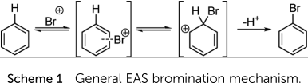
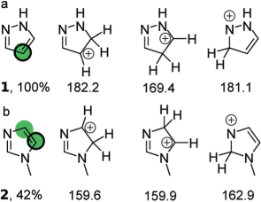
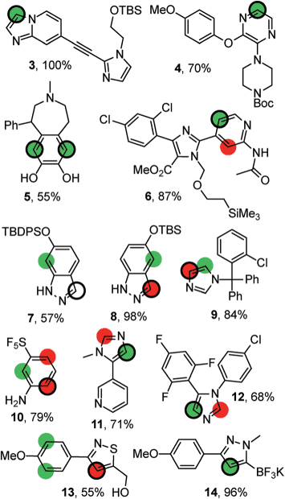
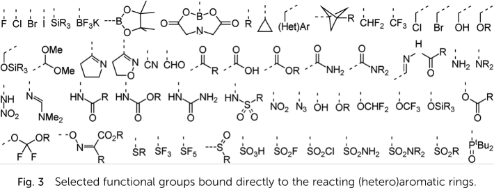

# RegioSQM

The program predicts the regioselectivity of electrophilic aromatic
substitution reactions in heteroaromatic systems. RegioSQM finds the
aromatic CH group with the highest proton affinity estimated by the
PM3/COSMO method using the MOPAC program, and maps these sites (*vide
infra*).  There is a dedicated web site, [regiosqm.org](http://regiosqm.org) to use this
program freely, expecting a SMILES string as molecular descriptor.
More information is available at the [RegioSQM paper](https://doi.org/10.1039/C7SC04156J), which is an open
access publication.

# Background

For the electrophilic substitution reaction (EAS) on aromatic and
heteroaromatic compounds

RegioSQM probes any position *theoretically* possible by the addition
of hydrogen to yield the charged intermediate.  For each position, the
difference of the Free Enthalpy between the starting material and the
intermediate is computed.  As in the example of pyrazole (line a)

the protonation in 4-position is the least endothermic.  At the level
of PM3, the computed change is \(\Delta{}G\) = 169.4 kcal/mol.  RegioSQM
indicates this position most favorable to the hydrogen addition by a
green circle.  This is backed by experimental findings; in the course
of the EAS, bromine of *N*-bromosuccinimide (NBS) exclusively adds to
this position.

Beside the identification of the site predicted most likely
susceptible to the EAS, RegioSQM sorts the other *theoretically*
possible positions by the energetic cost to add a proton.  In the
example of *N*-methlyl imidazole (line b), RegioSQM identifies both
the positions 4 and 5 as much more susceptible to the reaction, than
position 2.  Because the enthalpic difference for a reaction at
position 4 and a reaction at position 5 differs by less than
1 kcal/mol (4.18 kJ/mol), RegioSQM marks both positions by a green
circle.  Synthesis has shown that the reaction with NBS leads to a
product mixture from these two intermediates.

Sites where the EAS costs more than 1 kcal/mol, but less than
3 kcal/mol in addition to the reaction at the site most favorable to
the EAS are labeled by a read dot.  Sites exceeding even the higher
threshold of 3 kcal/mol (i.e., 12.6 kJ/mol) are considered as not
reactive enough to participate in the EAS; these are not marked *at
all*.

As shown in the figure below, sterical hindrance may yield an
experimental outcome different from the prediction even if the program
tests, where applicable, multiple conformers per site tested.

The authors emphasize the little computational cost to perform this
quick prediction for a wide range of substitutents with a success rate
of up to 92 or 96% (depending on the threshold considered).
Contrasting to invest in a DFT analysis, this approach completes
within minutes.

# Installation

RegioSQM depends on MOPAC for quantum calculations and uses OpenBabel
for format conversions.  RDKit and numpy perform complementary
computations in the Python environment.  Information about their
installation may be found at

-   MOPAC (<http://openmopac.net/>)
-   obabel (<https://github.com/openbabel/openbabel/releases>)
-   RDKit (<http://www.rdkit.org/docs/Install.html>)
-   numpy
    (<https://numpy.org/doc/stable/user/install.html?highlight=installation>),
    which often already is included in scipy
    (<https://scipy.org/install.html>)

# Usage

Folder `example` contains in file `example.smiles` the SMILES strings
of pyrazol (`n1ccc[nH]1`, `comp1`) and 1-(2-pyrimidinyl)-pyrazole
(`c1cnn(c1)-c1ncccn1`, `comp2`).  The following demonstrates the
batch-wise prediction, based on the entries in this file equally is
placed in the directory `regiosqm`.

If your molecule editor shouldn't be capable to export a structure as
a SMILES string, consider the conversion of the structure exported
into a different format by openbabel.  Services like the [PubChem
Sketcher](https://pubchem.ncbi.nlm.nih.gov/edit3/index.html) equally allow the generation of this information.

## preparation of the computation

By the call of

    1  python ../regiosqm/regiosqm.py -g example.smiles > example.csv

sites potentially susceptible for the EAS are identified.  RegioSQM
*generates* for each input files for MOPAC (`example.mop`) and
stores an initial conformation in a structure-data file
(`example.sdf`).  These are summarized in file `example.csv`.

## performing the computation

The authors recommend [GNU Parallel](https://www.gnu.org/software/parallel/) as an interface to submit all
computational jobs to MOPAC for a non-supervised execution by

    2  ls *mop | parallel -j4 "/opt/mopac/MOPAC2016.exe {}"

The parameter `-j4` allows the simultaneous processing of up to
four `.mop` files.  Because MOPAC allocates one CPU to one `.mop`
file to work with, this integer must be less or equal the number of
CPU cores available.  If MOPAC was not installed in the recommended
default directory (see [work-around](http://openmopac.net/Manual/trouble_shooting.html#default%20location)), you should adjust the path
leading to MOPAC's executable accordingly.

For each `example.mop`, the computation yields with `example.arc`
an archive, `example.out` a logging output, and `example.out.sdf`.
As in the case for imidazole, the later may be empty.

## analysis of the computation

RegioSQM is used again, but now by

    3  python2 regiosqm.py -a example.smiles example.csv > results.txt

to scrutiny MOPAC's results.  Given the starting structures in
`example.smiles` and the list of conformers in `example.csv` as the
two mandatory parameters, Gibbs' Free enthalpy of the formation of
the intermediate will be read out for each theoretically plausible
position for the EAS.  MOPAC's computations, are summarized and
redirected to `results.txt` as a table

    comp1 1 1,3
    comp2 2 2

The first column, recalls the name of the parental structure
provided by `example.smiles`.  This column is followed by the
column about the position most likely susceptible to the EAS.  This
column may be populated by the label of additional positions if
their intermediate was found to differ 1 kcal/mol (or less)
different to this least endothermic pathway.  The third column
lists all positions with an intermediate less than 3 kcal/mol
different than the least endothermic pathway, including the most
favorable position, too.

In the background, RDKit is called to illustrate this summary with
one `.svg` per parental structure.  Sites within the 1 kcal/mol
threshold are marked in green, sites between the 1 kcal/mol and
3 kcal/mol threshold by a red dot.

    # generate conformations from SMILES
    #
    # geometries are saved as .sdf and .mop input files,
    # example.csv lists e.g., the structure (as SMILES) of the protonated probes
    python ../regiosqm/regiosqm.py -g example.smiles > example.csv
    
    
    # Run all .mop files with mopac
    # or submit them to a cluster
    ls *mop | parallel -j4 "mopac {}"
    
    # use the generated csv file to analyze all the 
    python ../regiosqm/regiosqm.py -a example.csv example.csv > example_results.csv

The results may now be parsed from the results file, or displayed as
2D structures with regioselective indicators (in svg format).

